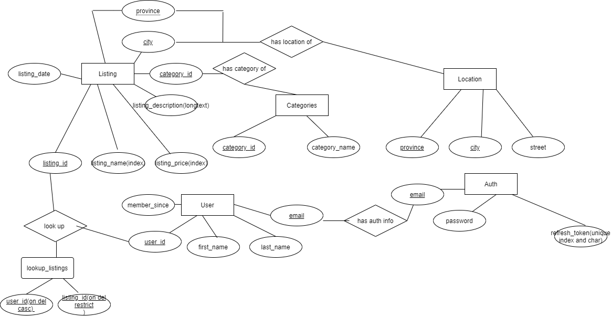

## Diagram

## Specifications of The Database:

- at least six database tables
- each table must have a primary key
- at least one of the primary keys must be an auto-incremented integer primary key (like a Member ID)
- at least one of the primary keys must be a 'natural' primary key that relies on its data (like a student ID)
- at least one of the primary keys must consist of more than one field
- at least one lookup table (like member_keyword)
- at least one each of the data types INT, CHAR, VARCHAR(n), DATE, DATETIME, LONGTEXT, DECIMAL in at least one of the tables

- foreign keys such that:
  - all tables must be a foreign key source or destination
  - at least one table must be both a foreign key source and destination (like supp_key)
  - at least one view that displays the results of a two table foreign key relationship (like v_keyword_supp_key)
  - at least one two-step foreign key relationship (like member_supp_key → supp_key → keyword)
  - at least one view that displays the results of a three table foreign key relationship (like v_member_keyword
  - at least one foreign key with an ON DELETE/ON UPDATE CASCADE constraint
  - at least one foreign key with an ON DELETE/ON UPDATE RESTRICT constraint
- at least one field that allows NULL as the default value
- at least one DATETIME field with a default value of the current date/time
- at least one non-DATE/TIME field with a custom default value of your choice
- at least one unique index on a non-primary key field (like k_desc in keyword)
- at least one non-unique index on non-primary key fields (like Index_name in member)
- at least one procedure
- at least one function
- at least one trigger that acts like a CHECK constraint
- at least one event
- no table may have less than three rows (like the pub_type table)
- at least one table must have a minimum of ten rows
